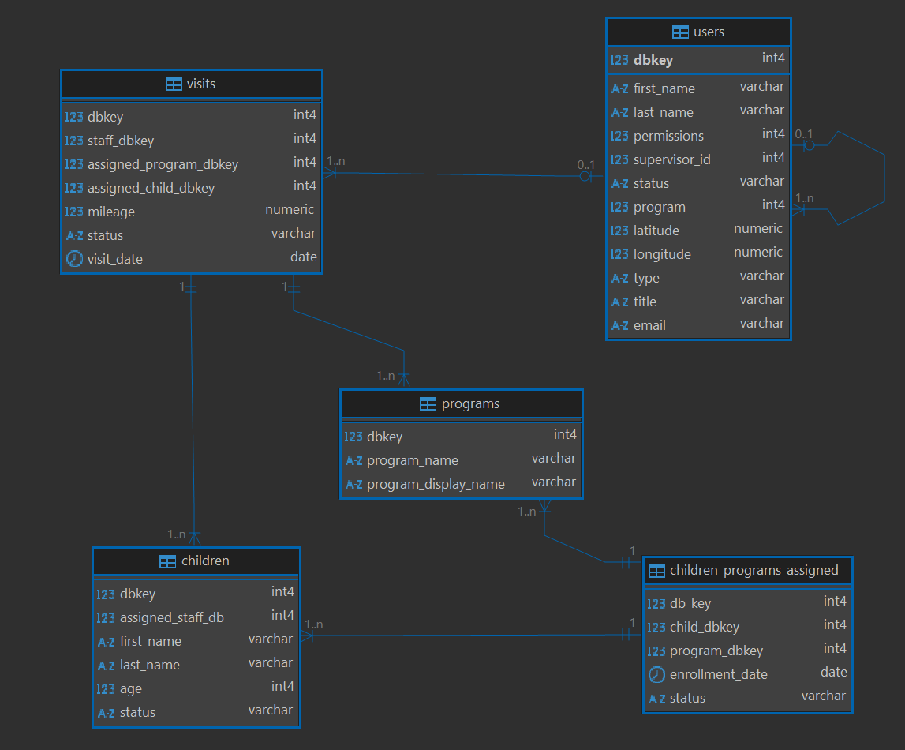
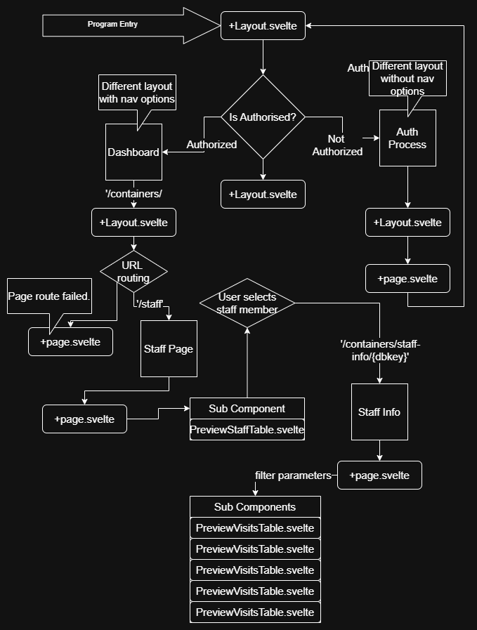

# Installation

To get started, run:

```bash
npm install
```

Then, copy the example environment file:

```bash
cp .env-example .env
```

Modify the `.env` file to match your current database setup.

## Database Setup

Run the `ascend-collin-ferguson-demo.sql` file to import the test data into the database.  
This will create all the necessary tables for running the program.


## Database Structure Diagram



## Explanation of Work

This project is built with Svelte 4 and SvelteKit, using a PostgreSQL database for test data storage.

While the main focus was on developing a functional **frontend demo**, I found it easier to build actual backend routes rather than relying on static JSON data or hardcoded arrays. Using SQL to link tables made data handling much simpler.

In some places, workarounds were used to pass data to components as props. These involve searching the raw HTML of the document instead of relying on framework-based state management. These areas are marked in the code. This approach was taken due to my limited experience with Svelte, I'm sure more elegant solutions exist.

## User Flow Diagram


## Known Issues
- **Pagination**: The tables are currently not requesting paginated data from the backend. Since the dataset is small and this is a demo, all matching data is sent in one request.

- **Data Relationships**: Some foreign key relationships may not be perfect. However, all foreign key constraints are defined in the database schema, which should help clarify what I was thinking as I developed it.

- Svelte 4's store subscription process is a little hard to wrap my head around, see /src/stores/authStore.ts for example of incorrect use of subscribe. 

- Header components love to have a forced tab in them.